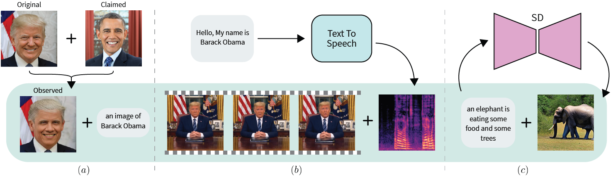

## Detecting Deepfakes Without Seeing Any

Official PyTorch Implementation of [**"Detecting Deepfakes Without Seeing Any"**](https://arxiv.org/pdf/2311.01458.pdf).

[](https://paperswithcode.com/sota/deepfake-detection-on-fakeavceleb-1?p=detecting-deepfakes-without-seeing-any)

## False Facts in Deepfake Attacks


(a) Face forgery: the claimed identity is seamlessly blended
into the original image. The observed image is accompanied by a false fact i.e., “an image of Barack
Obama”. 

(b) Audio-Visual (AV): fake audio is generated to align with the original video or fake
video is generated to align with the original audio. Fake media are accompanied by a false fact, that
the video and audio describe the same event. 

(c) Text-to-Image (TTI): the textual prompt is used§
by a generative model e.g. Stable Diffusion, to generate a corresponding image. The fake image is
accompanied by a false fact, that the caption and the image describe the same content.

## FACTOR


FACTOR leverages the
discrepancy between false facts and their imperfect synthesis within deepfakes. By quantifying the
similarity using the truth score, computed via cosine similarity, FACTOR effectively distinguishes
between real and fake media, enabling robust detection of zero-day deepfake attacks.

## Installation
Create a virtual environment, activate it and install the requirements file:
```
virtualenv -p /usr/bin/python3 venv
source venv/bin/activate
pip install -r requirements.txt
```

## 1. Face-Forgery
Please refer to `face-forgery/` and the [instructions](./face-forgery/README.md) for implementing the face-forgery model.

## 2. Audio-Visual
Please refer to `audio-visual/` and the [instructions](./audio-visual/README.md) for implementing the audio-visual model.


## Citation
If you find this useful, please cite our paper:
```
@article{reiss2023detecting,
  title={Detecting Deepfakes Without Seeing Any},
  author={Reiss, Tal and Cavia, Bar and Hoshen, Yedid},
  journal={arXiv preprint arXiv:2311.01458},
  year={2023}
}
```
